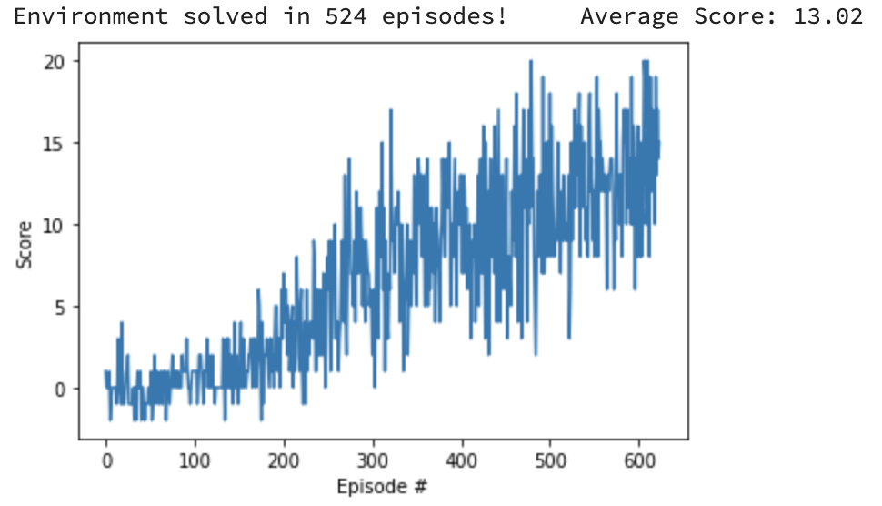

# Navigation Project Report

## Learning Algorithm

The final agent used a 3-layer neural network for it's Q-function. The layers were

```python
self.fc1 = nn.Linear(in_features=state_size, out_features=64)
self.fc2 = nn.Linear(in_features=64, out_features=64)
self.fc3 = nn.Linear(in_features=64, out_features=action_size)
```

The first two layers used ReLu activatation functions, and the final layer had no additional activation function. The final trained model used Double-Q Learning and experience replay.

The model was trained with an Adam optimizer on a cpu with hyperparameters

```python
BUFFER_SIZE = int(1e5)  # replay buffer size
BATCH_SIZE = 64  # minibatch size
GAMMA = 0.99  # discount factor
TAU = 1e-3  # for soft update of target parameters
LR = 5e-4  # learning rate
UPDATE_EVERY = 4  # how often to update the network
```

The final model was given up to 1800 episodes to train with (though it only needed <1000 in the end) and all training was done with random seed 7366 i.e. `agent = Agent(state_size, action_size, seed=7366, td_target_type="Double DQN")`

## Rewards plot

The agent completed the task with only 524 iterations as seen in the following plot



The plot illustrates that the agent's learning was often slow for extended stretches (e.g. average return increases by <1 for 100 episodes) punctuated by periods of rapid learning (e.g. average return increasing by >3 over 100 episodes).

## Future directions

There are three major directions that I would take this project to improve performance given more time:

* Prioritized experience replay -- I finished an implementation of prioritized experience replay (see the prioritized_replay branch), however my implementation was too slow to be practical. The key slowdown was in the algorithm for getting and updating priority weights. Future work here could change the replay buffer to use a binary heap (recommended by the original paper) to improve performance.
* Tune model architecture and hyperparameters -- I found that I was able to reliably solve the task without additional hyperparameter tuning, but it may be possible to solve it faster with a different model architecture or different hyperparameters.
* Investigate dependence on random seeds -- Through a few experiments, I found that model performance depended significantly on the random seed chosen for the agent. For example, with the 7366 seed finally chosen, a Fixed-Q Target approach didn't solve the problem at all in 1800 iterations while Double Q-Learning solved it in 524 iterations. However, I found other seeds where the original DQN worked very well and Double DQN was much slower to find a solution. Given the magnitude of random seed effects, I'd like to better understand if there's a way to better initialize the network to make it less sensitive to the seed.
